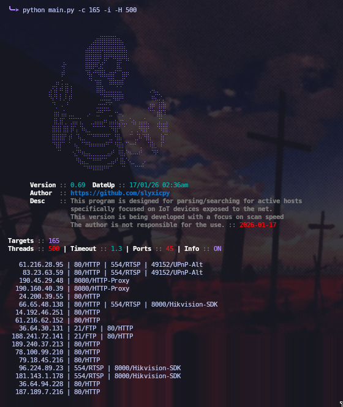

# Skiots V0.69
[](https://github.com/slyxicpy/skiots/actions)
[](https://github.com/slyxicpy/skiots/blob/main/LICENSE)
[](https://github.com/slyxicpy/skiots/stargazers)
[](https://github.com/slyxicpy/skiots/network/members)
[](https://github.com/slyxicpy/skiots/issues)

> **Skiots** it is a simple project focused on host recognition and verification
> It is especially focused on recognizing **IoT devices** and their port information
> Scanning speed and optimization are being improved to avoid high bandwidth usage.
> Its version is still under development, so its use might not be entirely satisfactory, **but it serves its purpose**.

## Features
- Active host discovery on networks
- Focused on IoT device scanning
- C extension for faster connection speed

## Installation & use
```
git clone https://github.com/slyxicpy/skiots.git
cd skiots
python3 main.py -h
```


